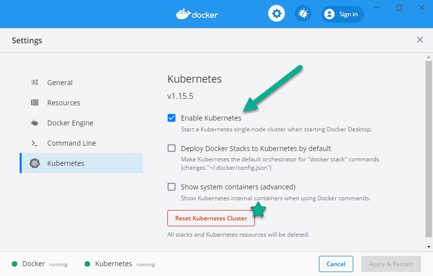

# k8s_fast_workshop

### RECURSOS

instalar docker:

Ubuntu:
https://docs.docker.com/engine/install/ubuntu/

MacOS
https://docs.docker.com/desktop/mac/install/

WINDOWS
https://docs.docker.com/desktop/windows/install/





### Comandos comunes para PODS 

+ crear un pod 

```shell
kubectl create -f <path_yaml_file>
```

+ eliminar un pod 

```shell
kubectl delete -f <path_yaml_file>
```

+ aplicar configuración a un pod

```shell
kubectl apply -f <path_yaml_file>
```

+ listar pods 

```shell 
kubectl get pods
```

+ listar pods con más información

```shell
kubectl get pods -o wide
```

+ describir información de un pod

```shell
kubectl describe pod/<POD_NAME>
```

+ describir información de un pod

```shell
kubectl describe pod/<POD_NAME>
```

### Comandos comunes para Deploys

+ Listar los deployments disponibles
```shell
kubectl get deployments
```

+ Listar los deployments disponibles
```shell
kubectl describe deployments/<deployment_name>
```
+ Listar los deployments disponibles
```shell
kubectl get replicaset
```
+ Escalar un deployment
```shell
kubectl scale deployment/<deployment_name> --replicas=<numero de replicas>
```

